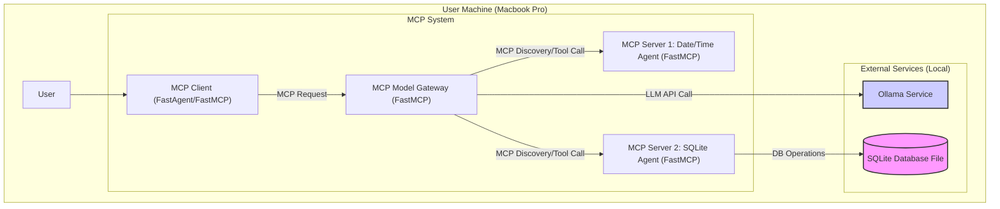
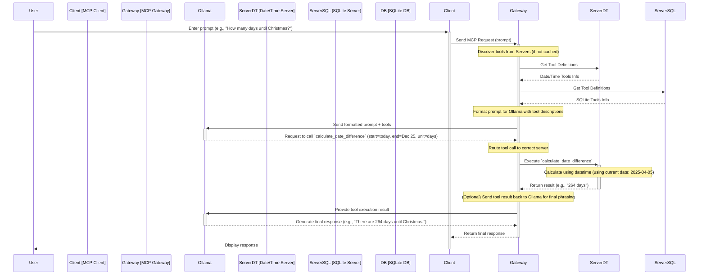

# ARCHITECTURE.md

## 1. Overview

This document describes the architecture of a local application designed to interact with a Large Language Model (LLM) served by Ollama. The system leverages the **Model Context Protocol (MCP)** to provide the LLM with access to specific tools and data sources related to date/time calculations and SQLite database manipulation.

The primary goal is to create a modular and extensible system where specialized agents (implemented as MCP Model Servers) provide distinct functionalities, orchestrated by a central MCP Gateway. The entire system, including the LLM, runs locally on a single machine (specified as a Macbook Pro M4 Max).

## 2. Core Principles

* **Model Context Protocol (MCP):** Adherence to MCP for standardized communication between the client, gateway, and function-providing servers.
* **Local Execution:** All components, including the LLM via Ollama, run locally, ensuring privacy and removing external network latency for core operations.
* **Modularity:** The system is broken down into distinct components (Client, Gateway, Servers), allowing for independent development, testing, and potential future expansion with new agents/servers.
* **Separation of Concerns:**
    * The LLM handles natural language understanding and response generation.
    * MCP Servers handle the execution logic for specific tools (Date/Time, SQLite).
    * The MCP Gateway handles orchestration, tool discovery, LLM interaction, and routing.
    * The MCP Client handles user interaction.
* **Tool-Based Functionality:** The LLM's capabilities are extended by providing it access to specific tools defined by the MCP Servers.

## 3. Components

The system comprises the following key components:

**3.1. Ollama LLM Service**
* **Description:** Runs the core Large Language Model locally. It receives prompts (potentially augmented with tool information) from the MCP Gateway and returns natural language responses or instructions to use specific tools.
* **Technology:** Ollama.
* **Interface:** Standard Ollama HTTP API (e.g., `http://localhost:11434/api/chat`).

**3.2. MCP Model Server 1: Date/Time Agent**
* **Description:** An MCP-compliant server providing tools related to date and time. It runs as a separate process.
* **Technology:** Python, `FastMCP` library.
* **Responsibilities:**
    * Exposes tools over MCP: `get_current_time`, `get_current_date`, `calculate_date_difference`.
    * Executes these tools when requested by the Gateway.
    * Uses Python's `datetime` module for implementation.
* **Interface:** MCP protocol (listens on a dedicated port, e.g., 8001).

**3.3. MCP Model Server 2: SQLite Agent**
* **Description:** An MCP-compliant server providing tools, a resource, and a prompt for interacting with a local SQLite database. It runs as a separate process.
* **Technology:** Python, `FastMCP` library, `sqlite3` module.
* **Responsibilities:**
    * Manages a connection to a local SQLite DB file.
    * Exposes tools over MCP: `read_query`, `write_query`, `create_table`, `list_tables`, `describe-table`, `append_insight`.
    * Exposes a dynamic resource over MCP: `memo://insights`.
    * Exposes a guided prompt over MCP: `mcp-demo`.
    * Executes database operations and updates the memo resource when requested by the Gateway.
* **Interface:** MCP protocol (listens on a dedicated port, e.g., 8002).

**3.4. MCP Model Gateway**
* **Description:** The central hub of the system. It orchestrates communication between the Client, the LLM (Ollama), and the different MCP Servers. It runs as a separate process.
* **Technology:** Python, `FastMCP` library, `httpx` (or similar HTTP client).
* **Responsibilities:**
    * Listens for requests from the MCP Client.
    * Discovers tools, resources, and prompts available from registered MCP Servers (Date/Time, SQLite).
    * Formats prompts for the Ollama LLM, including definitions of available tools.
    * Communicates with the Ollama API.
    * Parses LLM responses to detect tool usage requests.
    * Routes tool execution requests to the appropriate MCP Server via MCP.
    * Sends tool results back to the LLM (if needed for final response generation).
    * Returns the final response to the MCP Client.
* **Interface:** MCP protocol for Client and Servers (listens on a port, e.g., 8000), HTTP API for Ollama.

**3.5. MCP Model Client**
* **Description:** The user-facing interface. It sends user prompts to the Gateway and displays the final responses.
* **Technology:** Python, `FastAgent` or `FastMCP` client libraries.
* **Responsibilities:**
    * Provide a user interface (e.g., CLI).
    * Send user prompts to the MCP Gateway via MCP.
    * Receive and display responses from the Gateway.
* **Interface:** User Interface (CLI), MCP protocol towards Gateway.

**3.6. SQLite Database**
* **Description:** A standard local SQLite database file (`.db`).
* **Technology:** SQLite3.
* **Accessed by:** MCP Model Server 2 (SQLite Agent).

## 4. Communication Protocols

* **Client <-> Gateway:** Model Context Protocol (MCP)
* **Gateway <-> Servers:** Model Context Protocol (MCP)
* **Gateway -> Ollama:** HTTP/JSON (Ollama REST API)
* **SQLite Server -> Database:** SQLite library calls (local file access)

## 5. Data Flow / Interaction Sequence (Example: Tool Usage)

1.  **User Input:** User enters a prompt into the MCP Client (e.g., "How many rows in the 'orders' table?").
2.  **Client Request:** The Client sends the prompt to the MCP Gateway via MCP.
3.  **Gateway Discovery:** The Gateway (if needed) queries connected Servers (Date/Time, SQLite) via MCP to get their available tool definitions.
4.  **LLM Interaction:** The Gateway formats the prompt for Ollama, including descriptions of relevant tools (like `read_query`, `list_tables` from the SQLite server). It sends this payload to the Ollama HTTP API.
5.  **LLM Analysis & Tool Request:** Ollama analyzes the prompt and the available tools. It determines that `read_query` is needed and sends a response back to the Gateway indicating the tool to call (`read_query`) and its arguments (`query="SELECT COUNT(*) FROM orders;"`).
6.  **Gateway Routing:** The Gateway receives the tool call request, identifies that `read_query` belongs to the SQLite Server, and forwards the execution request (tool name + arguments) to the SQLite Server via MCP.
7.  **Server Execution:** The SQLite Server receives the request, executes the `SELECT COUNT(*)` query against the local SQLite database file, and retrieves the result (e.g., `[{ "COUNT(*)": 150 }]`).
8.  **Server Response:** The SQLite Server sends the execution result back to the Gateway via MCP.
9.  **Final Response Generation:** The Gateway receives the tool result. It may send this result back to Ollama to allow the LLM to formulate a natural language answer (e.g., "There are 150 rows in the 'orders' table."). Ollama sends the final text response back to the Gateway.
10. **Client Response:** The Gateway forwards the final natural language response to the MCP Client via MCP.
11. **User Output:** The Client displays the final response to the user.

*Note: If the initial prompt doesn't require a tool, the flow skips steps 5-9, and Ollama's initial response (step 4 result) is directly forwarded to the client.*

## 6. Diagrams

### 6.1 Relationshitp

### 6.2 Request Flow

## 7. Technology Stack Summary

* **Orchestration/Protocol:** Model Context Protocol (MCP)
* **MCP Implementation:** `FastMCP` Python SDK
* **Client Implementation:** `FastAgent` or `FastMCP` Python SDK
* **Backend Language:** Python
* **LLM Service:** Ollama
* **Database:** SQLite3
* **Web Server (for MCP components):** Uvicorn (typically used with FastMCP/FastAPI)
* **API Communication:** HTTP/JSON (Gateway <-> Ollama)
